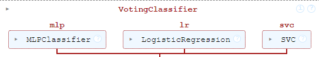
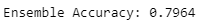
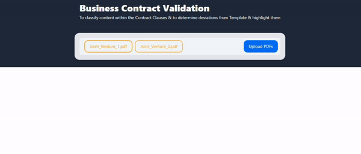
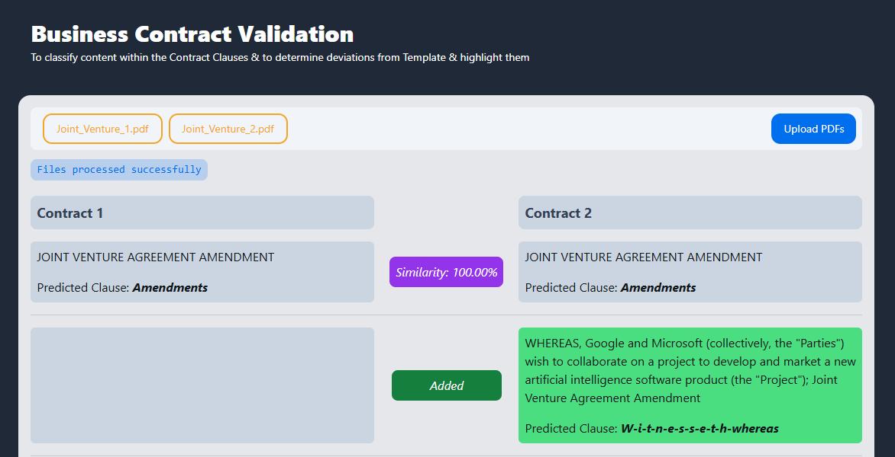
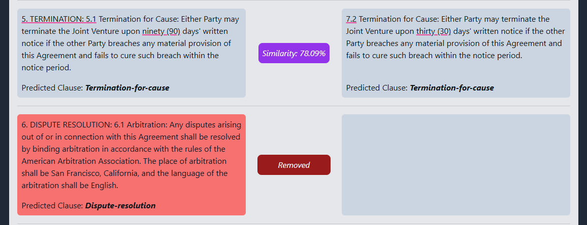

# Intel Unnati
## Business-Contract-Validation

### Description
Business Contract Validation is a powerful tool designed to automate the classification of contract clauses and highlight similarities and differences between them. This project leverages machine learning to provide accurate and efficient contract analysis, helping businesses streamline their contract management process.

### Features
- **Clause Classification:** Automates the categorization of contract clauses into predefined types based on their content.
- **Clause Comparison:** Highlights similarities and differences between clauses to aid in contract analysis and revision.
- **PDF Integration:** Enables seamless handling of PDF documents by extracting text and processing clauses.
- **Visualization:** Presents classification results and similarity scores with detailed annotations for easy interpretation.

Read the full documentation [here](https://docs.google.com/document/d/1ilGt6nBhqJ76-m2qmWyN0MH4yu1N1lc0/edit?usp=sharing&ouid=118347987277311010102&rtpof=true&sd=true)

### Training Model using Ensemble Classification technique

### Training Accuracy on Validation data

### Demo

### Screenshots

